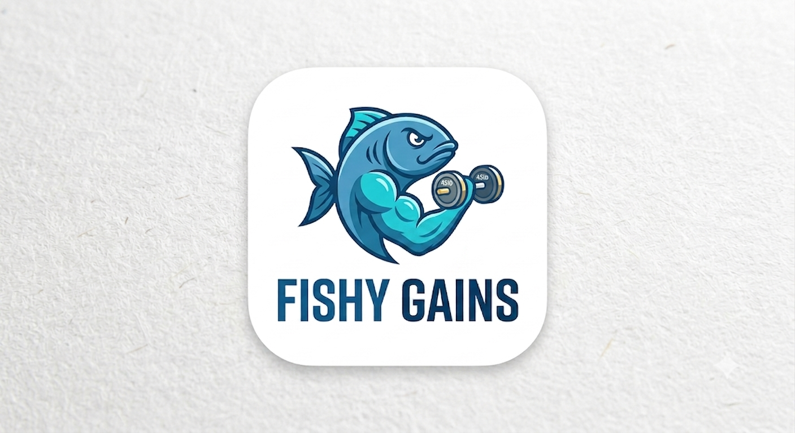

<div align="center">



# Fishy Gains

### Offline-First Workout Tracker for Lifters & Strength Athletes

Fishy Gains is a modern workout tracker built with **React Native** and **Expo**, designed for bodybuilders, powerlifters, and fitness enthusiasts who want a fast, distraction-free training experience.

Featuring a **hybrid exercise library** with over **800 built-in exercises**, workout routines, progress analytics, body tracking, and complete offline functionality, Fishy Gains keeps you focused on training—not internet connectivity.

[](https://github.com/Fish-DeveloperAi/Fishy-Gains/releases)


</div>

---

# 📖 Overview

Fishy Gains is an **offline-first workout tracker** built for lifters who want a simple, powerful, and privacy-friendly way to log workouts and monitor long-term progress.

Everything is stored locally using SQLite—no accounts, no cloud storage, and no subscriptions. Whether you're tracking personal records, creating workout routines, or monitoring body measurements, your data stays on your device.

---

# ✨ Features

### 🏋️ Hybrid Exercise Library

- 800+ built-in exercises
- Unlimited custom exercises
- Unified search across both libraries
- Simplified muscle groups:
  - Chest
  - Back
  - Shoulders
  - Arms
  - Legs
  - Core

Built-in and custom exercises work together seamlessly throughout the app.

---

### 🖼 Dynamic Exercise Images

Exercise thumbnails are loaded on demand, providing visual guidance while keeping the APK lightweight.

- High-quality exercise images
- Faster downloads
- Reduced storage usage

---

### 📝 Workout Logging

Quickly log workouts with:

- Weight × reps
- Workout sessions
- Exercise history
- Fast editing between sets

---

### 📈 Progressive Overload

Automatically detects new Personal Records while you train.

No manual tracking required.

---

### 📊 Visual Progress Tracking

Analyze your training with interactive charts.

Track:

- Strength progression
- Training volume
- Exercise history
- Long-term trends

---

### 📅 Workout Routines

Create reusable workout templates such as:

- Push
- Pull
- Legs
- Upper / Lower
- Full Body

Start complete workouts with a single tap.

---

### 📏 Body Tracking

Monitor changes over time by logging:

- Bodyweight
- Chest
- Waist
- Arms

---

### 📤 Shareable Workout Cards

Generate beautiful workout summaries featuring:

- Workout statistics
- Personal Records
- Training volume

Share directly to social media.

---

### 📴 Offline First

Everything works completely offline.

- No backend
- No accounts
- No subscriptions
- No cloud storage

Your workout data never leaves your device.

---

# 🛠 Tech Stack

| Category | Technology |
|----------|------------|
| Framework | React Native (Expo) |
| Language | JavaScript |
| Database | Expo SQLite |
| Navigation | React Navigation |
| Charts | react-native-chart-kit |
| Sharing | react-native-view-shot |
| Native Sharing | expo-sharing |
| Exercise Dataset | free-exercise-db (Public Domain) |

---

# 🏗 Architecture

```text
                 User
                  │
                  ▼
         React Native (Expo)
                  │
      ┌───────────┴───────────┐
      ▼                       ▼
 Workout Tracking      Progress Analytics
      │                       │
      └───────────┬───────────┘
                  ▼
            SQLite Database
```

---

# 🚀 Getting Started

## Prerequisites

- Node.js
- npm
- Expo Go

Clone the repository:

```bash
git clone https://github.com/Fish-DeveloperAi/Fishy-Gains.git
cd Fishy-Gains
```

Install dependencies:

```bash
npm install --legacy-peer-deps
```

Run the app:

```bash
npx expo start
```

Scan the QR code using **Expo Go** on Android or iOS.

---

# 🔒 Privacy

Fishy Gains is designed with privacy in mind.

- No accounts
- No analytics
- No advertisements
- No subscriptions
- No cloud synchronization

Everything stays on your device.

---

# 📚 Data Source

Exercise information is provided by **free-exercise-db**, released under the **Unlicense (Public Domain)**.

---

# 🔮 Roadmap

### 🍎 Apple Health

Sync workouts and body measurements with Apple Health.

### 🤖 Google Fit

Keep your workout history synchronized with Google Fit.

### 🏆 Ocean Rank System

A unique progression system based on your **Big Three Total**:

- Squat
- Bench Press
- Deadlift

Unlock ocean-inspired ranks as your strength increases.

| Total | Rank |
|------:|------|
| 100 kg | 🐟 Sardine |
| 200 kg | 🐠 Mackerel |
| 300 kg | 🐡 Tuna |
| 400 kg | 🦈 Shark |
| 500 kg | 🐬 Dolphin |
| 600 kg | 🐋 Orca |
| 700 kg | 🐋 Sperm Whale |
| 800 kg+ | 👑 Leviathan |

---

# 🤝 Contributing

Contributions are welcome.

```bash
git checkout -b feature/my-feature
git commit -m "Add awesome feature"
git push origin feature/my-feature
```

Then open a Pull Request.

---

# 👨‍💻 Authors

### Amine Bakhda

- GitHub: https://github.com/Fish-DeveloperAi

### Aymen Hakkaoui

- GitHub: https://github.com/TheDeadShadow47

---

<div align="center">

### 🐟 Train Smarter. Lift Heavier. Stay Offline.

Built with React Native, Expo, and SQLite.

⭐ If you enjoy Fishy Gains, consider giving the repository a star!

</div>
